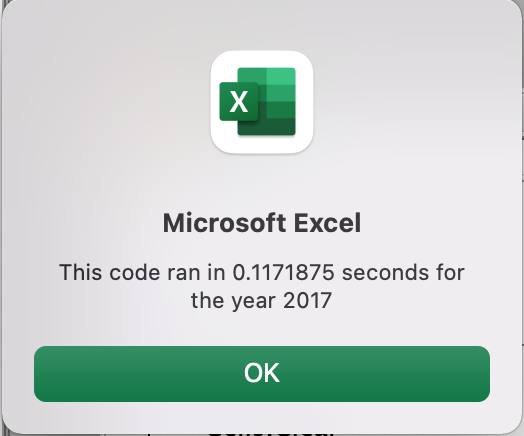

# Stock-Analysis
## Overview of Project
  An analysis of different stock prices and volume was completed in order to determine how the stocks of different green energy companies performed over the years 2017 and 2018.
### Purpose
  Steve is a recent finance graduate who is helping his parents decide which green energy companies they should be buying stock in. They had originally bought stock in DQ, but after finding that this company has not been performing well, data on 11 other green energy companies was perfomred in order to help his parents choose the best company to invest in. Steve was also interested in adding data on how the entire stock market has performed over the years 2017 and 2018, in order to provide his parents with more research. 
## Analysis of Stock Performance
  Based on the code that was ran, I was able to see the total daily volume and percent return for each of the 12 stocks included in this data set for the years 2017 and 2018. A table of the 2017 daily volume and percent return can be seen below:
  
  
  All but 1 of these stocks in 2017 had a positive yearly return, meaning that all but 1 of these stocks experienced an increase in their price. This means that these 11 stocks would have netted an increase in your investment. 
  However, the year 2018 showed a much different picture. A table of the 2018 daily volume and percent return can be seen below:
  


  In 201t8, only 2 stocks on this list had a positive yearly return, which means that most of the stocks listed experience a decrease in their stock price. We can also see that the total daily volume for these 10 stocks dramatically decreased from 2017 as well. This means that these 10 stocks were traded significantly less in 2018 then they were in 2017.
   There were 2 stocks that maintained a positive yearly return as well as significantly increased their total daily volume between 2017 and 2018. These 2 companies are referred to with the ticker symbol ENPH and RUN. These would be companies that I would suggest Steve's parents look at investing into.  
## Analysis of Refactored Code
  Prior to refactoring the code, our orignal code was only running across 1 array that we had named "ticker". This was allowing us to quickly see the daily volume and percent return of each of the 12 tickers listed in the spread sheet. When running this code, my computer was taking around 0.7 seconds to display the information for both 2017 and 2018. I then decided to add 3 more arrays that would allow us to run this code across multiple different ticker values. This would allow us to use the data of 1,000's of different stocks instead of just the 12 included in this worksheet. When refactoring the code, I did not need to write new code at all. I was able to reuse the original code, but I just needed to replace the original variables of "total volume", "startingPrice" and "endingPrice" with the new arrays that I had created. The time it took to run the new code is below: 
  
 
 
 
 This was significantly less time than my first code. My refactored code that I had to change can be seen below. 
 
```
  '1a) Create a ticker Index
        tickerIndex = 0

    '1b) Create three output arrays
        Dim tickerVolumes(12) As Long
        Dim tickerStartingPrices(12) As Single
        Dim tickerEndingPrices(12) As Single
    
    '2a) Create a for loop to initialize the tickerVolumes to zero.
        For i = 0 To 11
            tickerVolumes(i) = 0
        Next i
        
    '2b) Loop over all the rows in the spreadsheet.
    Worksheets(yearValue).Activate
    For i = 2 To RowCount

 '3a) Increase volume for current ticker
            If Cells(i, 1).Value = tickers(tickerIndex) Then
            	tickerVolumes(tickerIndex) = tickerVolumes(tickerIndex) + Cells(i, 8).Value
            End If

   '3b) Check if the current row is the first row with the selected tickerIndex.
        If Cells(i - 1, 1).Value <> tickers(tickerIndex) And Cells(i, 1).Value = tickers(tickerIndex) Then
                tickerStartingPrices(tickerIndex) = Cells(i, 6).Value 
        End If
        
   '3c) check if the current row is the last row with the selected ticker
	 If Cells(i + 1, 1).Value <> tickers(tickerIndex) And Cells(i, 1).Value = tickers(tickerIndex) Then
                tickerEndingPrices(tickerIndex) = Cells(i, 6).Value
        End If
            
    '3d Increase the tickerIndex.
            If Cells(i, 1).Value = tickers(tickerIndex) And Cells(i + 1, 1).Value <> tickers(tickerIndex) Then
                tickerIndex = tickerIndex + 1 
            End If
    
    Next i
    
    '4) Loop through your arrays to output the Ticker, Total Daily Volume, and Return.
   Worksheets("All Stocks Analysis").Activate
    For i = 0 To 11
    Cells(4 + i, 1).Value = tickers(i)
    Cells(4 + i, 2).Value = tickerVolumes(i)
    Cells(4 + i, 3).Value = tickerEndingPrices(i) / tickerStartingPrices(i) - 1
```

## Summary

